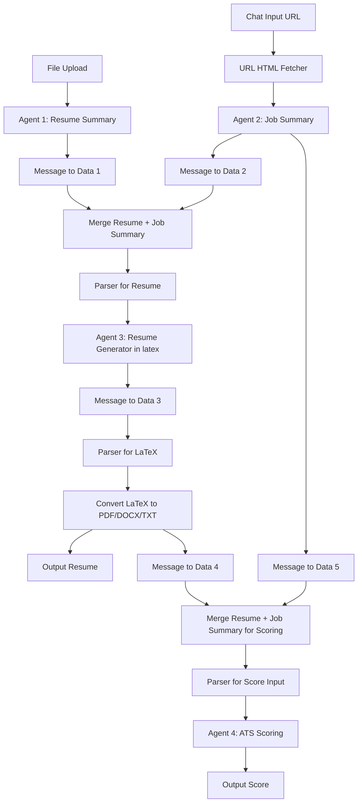

# 🧠 LangFlow MCP High ATS Resume Creator (ATS-Aware)

This repository contains a LangFlow-exported `.json` file representing a **custom multi-agent flow**, designed to act as an **MCP server**. This flow can be used with **Claude Desktop** or **any MCP-compatible client**.

Its core functionality is to **generate a high ATS (Applicant Tracking System) score resume** based on a LinkedIn job post URL and a user's existing resume. The system parses both sources, summarizes relevant content, and produces a tailored, ATS-friendly resume in multiple formats.

---

## 📜 Architectural Decision Records (ADRs)

### ADR 001 – Why LangFlow?
LangFlow allows for **modular low-code orchestration** of agentic LLM pipelines, making it ideal for our goal of chaining multiple agents with custom components and data parsers.

### ADR 002 – Why MCP Server?
By exposing this flow as an MCP server:
- It becomes interoperable with **Claude Desktop** and other MCP clients.
- Users can interact via chat interfaces and benefit from stateful agent behavior.
- Encourages **reuse and composability** across different workflows.

### ADR 003 – Agent Design and Flow

#### 🎯 Agent 1: Resume Summarizer
- **Input:** User's current resume (raw text or document)
- **Output:** Summary of professional experience, total years, key skills, responsibilities, and education.
- ✅ Focused extraction using resume-aware prompt logic.

#### 🎯 Agent 2: Job Description Summarizer
- **Input:** LinkedIn job post URL via chat.
- **Output:** Structured summary of required qualifications.
- 🛠️ Powered by a **custom LangFlow component** that parses HTML directly from the URL input.

#### 🔄 Data Parsing and Conversion
- Each agent's output passes through a **Message-to-Data Converter**, followed by a **combined parser** to normalize structure and prepare inputs for resume generation.

#### 🎯 Agent 3: Resume Generator
- **Input:** Parsed summaries from Agent 1 & Agent 2.
- **Output:** ATS-optimized resume in **LaTeX** format matching job criteria with user's skills.
- 🧠 Tailored resume structure focused on score improvement.

#### 🛠️ Custom LangFlow Component: Format Converter
- Converts LaTeX output to:
  - ✅ `PDF`
  - ✅ `DOCX`
  - ✅ `TXT`
- Makes the resume instantly downloadable and shareable.

#### 🎯 Agent 4: ATS Score Evaluator
- **Input:** Generated resume and job summary.
- **Output:** Final **ATS score (out of 100)** indicating how well the resume matches the job.
- ✅ Helps users iterate on improvements.

### 🔀 ADR 004 – Data Pipeline

---

## 🔗 Compatibility

✅ Works with:
- Claude Desktop (as MCP Client)  
- Any custom MCP-compatible chat client  

📦 LangFlow Version: `v1.4+`  

---

## 🧪 Example Use Case

> **Prompt:**  
> "Please generate an tailored resume for [LinkedIn Job URL]"

**Result:**  
- Tailored resume (PDF, DOCX, TXT)  
- ATS match score out of 100  
- Explanation of missing or weak areas  

---

## 🚀 Get Started

1. Clone this repo  
2. Import the `.json` into LangFlow  
3. Connect with MCP client (e.g., Claude Desktop)  
4. Start chatting!

---

## 🧩 Contributing

Have ideas for new agents or better format converters?  
We welcome contributions via PR or feedback.

---

## 📄 License

MIT License  
Copyright © 2025

---
